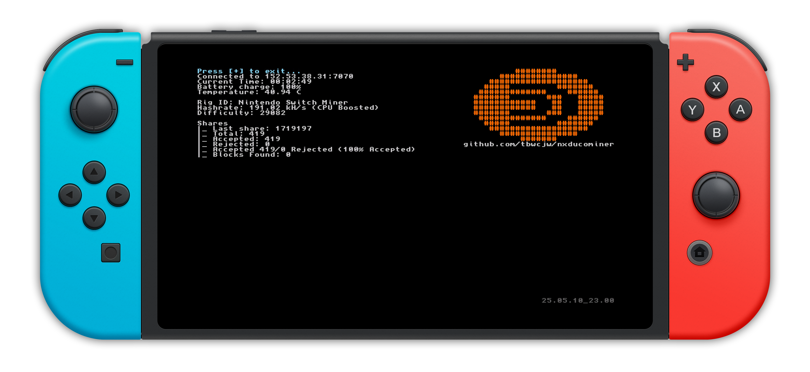
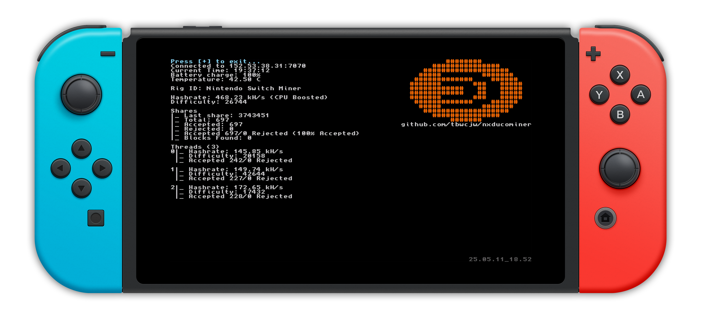
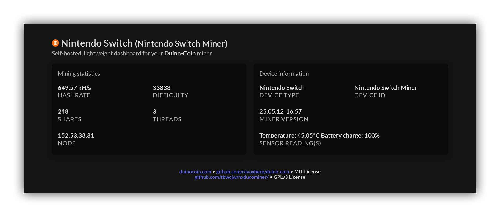

    <h2 align="center">nxducominer</h2>

    A multithreaded <a href='https://duinocoin.com'>DUCO</a> Miner for the Nintendo Switch.

    

<h4>Setup</h4>
<ul>
    <li>Unzip <code>[release].zip</code>, copy <code>switch/</code> to the root of your SD card.</li>
    <li>Set <code>config.txt</code>, explained <a href='#config'>below</a>.
    <li>Launch the miner from HB menu.</li>
</ul>
<table id="config">
    <thead>
        <tr>
            <th>Key</th>
            <th>Type</th>
            <th>Description</th>
        </tr>
    </thead>
    <tbody>
        <tr>
            <td><code>node</code></td>
            <td><code>str</code> <code>none</code></td>
            <td>The IP address of the node to connect to. Can be found manually <a href='https://server.duinocoin.com/getPool'>here</a>. If left empty the application will use <a href='https://server.duinocoin.com/getPool'>https://server.duinocoin.com/getPool</a> to find one.
        </tr>
        <tr>
            <td><code>port</code></td>
            <td><code>int</code> <code>none</code></td>
            <td>The port of the node. If this is left blank, the application will find a node using the method above. Regardless if the <code>node</code> is set.</td>
        </tr>
        <tr>
            <td><code>wallet_address</code></td>
            <td><code>str</code></td>
            <td>The address/username of your duinocoin wallet.
        </tr>
        <tr>
            <td><code>miner_key</code></td>
            <td><code>str</code> <code>none</code></td>
            <td>As specified in <code>Wallet > Settings > Miner Key</code>. Leave blank if not applicable.</td>
        </tr>
        <tr>
            <td><code>difficulty</code></td>
            <td><code>str</code></td>
            <td>The starting difficulty. The node will automatically negotiate the difficulty. Valid starting difficulties are <code>LOW</code> <code>MEDIUM</code> <code>NET</code> and <code>EXTREME</code>. Use either <code>LOW</code> or <code>MEDIUM</code>. <CODE>EXTREME</code> is not used anywhere officially. More information on difficulties can be found <a href='https://github.com/revoxhere/duino-coin/tree/useful-tools?tab=readme-ov-file#duco-s1-mining'>here</a>.</td> 
        </tr>
        <tr>
            <td><code>rig_id</code></td>
            <td><code>str</code></td>
            <td>A friendly name for your miner which displays in the wallet.</td>
        </tr>
        <tr>
            <td><code>cpu_boost</code></td>
            <td><code>bool</bool></td>
            <td>Either <code>true</code> or <code>false</code>. Using <a href='https://switchbrew.github.io/libnx/apm_8h.html#a5690c3a786c3bee6ef93f5db5354e080'>ApmCpuBoostMode</a> with mode <code>ApmCpuBoostMode_FastLoad</code>.</td>
        </tr>
        <tr>
            <td><code>iot</code></td>
            <td><code>bool</code> </td>
            <td>Either <code>true</code> or <code>false</code>. Upload IoT data to your wallet (Temperature, Battery charge).</td>
        </tr>
        <tr>
            <td><code>threads</code></td>
            <td><code>int</code> </td>
            <td>Number of threads to mine on. Between 1 and 6.</td>
        </tr>
        <tr>
            <td><code>web_dashboard</code></td>
            <td><code>bool</code> </td>
            <td>Either <code>true</code> or <code>false</code>. The web dashboard will run on port 8080 of the switch's IP address.</td>
        </tr>
    </tbody>
</table>

<h4>Building</h4>
<ul>
    <li>Install <a href='https://devkitpro.org'>devkitpro</a> with <code>switch-dev</code>, <code>switch-curl</code> and <code>switch-zlib</code> using the <a href='https://devkitpro.org/wiki/Getting_Started'>Getting Started</a> guide. For building releases you will need <code>zip</code>.
    <li>Clone <a href='https://github.com/tbwcjw/nxducominer.git'>https://github.com/tbwcjw/nxducominer.git</a>.
    <li>Copy <code>config.sample.txt</code> to <code>config.txt</code> and fill in the fields<a href='#config'>*</a>.
    <li>
        <code>make (all)</code> - build the application and generate a release.
         
        <code>make build</code> - build the application.
         
        <code>make release</code> - builds and generate a release.
         
        <code>make clean</code> - removes build/build data. does not remove releases
    </li>
    <li>Use NXLink to send <code>application.nro</code> and fptd to send the <code>config.txt</code>, ensuring it is in the same directory as <code>application.nro</code>.</li>
</ul>

<h4>Roadmap</h4>
<table>
    <thead>
        <tr>
            <th>Short term</th>
            <th>Mid term</th>
            <th>Long term</th>
        </tr>
    </thead>
    <tbody>
        <tr>
            <td>
                <li><s>Automatically select node.</s></li>
                <li>Better error handling.</li>
                <li><s>Reconnect to node if connection lost.</s></li>
                <li><s>Handle <code>consoleExit()</code> without error.</s></li>
                <li><s>Prevent switch from auto-sleeping in app.</s></li>
            </td>
            <td>
                <li><s>Web dashboard, like the ESP32 miner</s></li>
                <li><s>Multithreading.</s></li>
            </td>
            <td>
                <li>Pretty GUI.</li>
            </td>
        </tr>
    </tbody>
</table>

<h4>Benchmarking Results</h4>
<table>
    <thead>
        <tr>
            <th>Device/Version</th>
            <th>App version</th>
            <th>CFLAGS</th>
            <th>CPU Boost</th>
            <th>Threads</th>
            <th>Node (address:port)</th>
            <th>Shares /1hr</th>
            <th>Avg. Hashrate (estimated)</th>
        </tr>
    </thead>
    <tbody>
        <tr>
            <td><code>HAC-001</code><code>18.0.1|AMS 1.8.0|E</code></td>
            <td><code>25.05.13_00.27</code></td>
            <td><code>N/A</code> (Release)</td>
            <td><code>true</code></td>
            <td>3</td>
            <td>152.53.38.31:7070</td>
            <td>1212</td>
            <td>583.24 kH/s</td>
        </tr>
    </tbody>
</table>

<h4>Benchmarking</h4>
Use <a href='https://github.com/tbwcjw/nxducominer/blob/main/tools/benchmark_dirty.py'>benchmark_dirty.py</a> for official benchmarking. Submit results by opening an issue. Benchmarks should at least be one hour long.
<table>
    <thead>
        <tr>
            <th>Argument</th>
            <th>Description</th>
        </tr>
    </thead>
    <tbody>
        <tr>
            <td><code>-d</code> <code>--duration</code></td>
            <td>Duration to run the benchmark. (e.g., 10m, 1h, 30s).
             
            <i>Default: <code>1h</code></i></td>
        </tr>
        <tr>
            <td><code>--nx</code></td>
            <td>Path to nxlink/nxlink.exe.</td>
        </tr>
        <tr>
            <td><code>-ip</code></td>
            <td>Switch IP.</td>
        </tr>
        <tr>
            <td><code>--nro</code></td>
            <td>Path to application.nro.</td>
        </tr>
        <tr>
            <td><code>-o</code> <code>--output</code></td>
            <td>Path to benchmark results.
             
            <i>Default: <code>nxducominer_benchmark.txt</code></i></<td>
        </tr>
        <tr>
            <td><code>-og</code> <code>--output-graph</code></td>
            <td>Path to benchmark result graph.
             
            <i>Default: <code>nxducominer_benchmark_graph.png</code></i></td>
        </tr>
    </tbody>
</table>

<h4>Screenshots</h4>

<i>Single Threaded</i> 
 
<i>Multithreaded</i>
 
<i>Web dashboard</i>

<h4>Credits</h4>
JSON Parser: <a href='https://github.com/zserge/jsmn'>zserge/jsmn</a>, MIT License.

<h4>Licenses</h4>
 
nxducominer is free software: you can redistribute it and/or modify it under the terms of the GNU General Public License as published by the Free Software Foundation, either version 3 of the License, or (at your option) any later version.